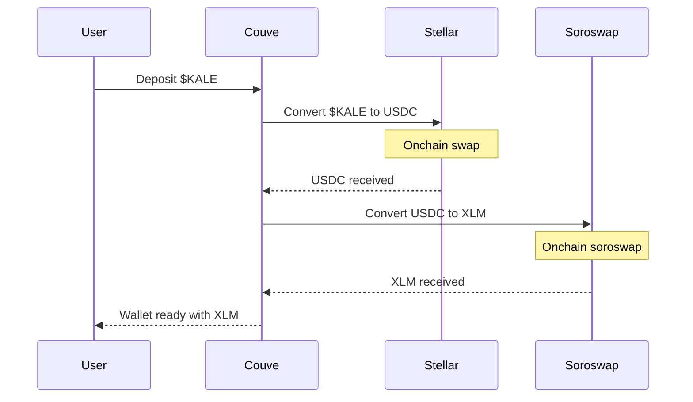
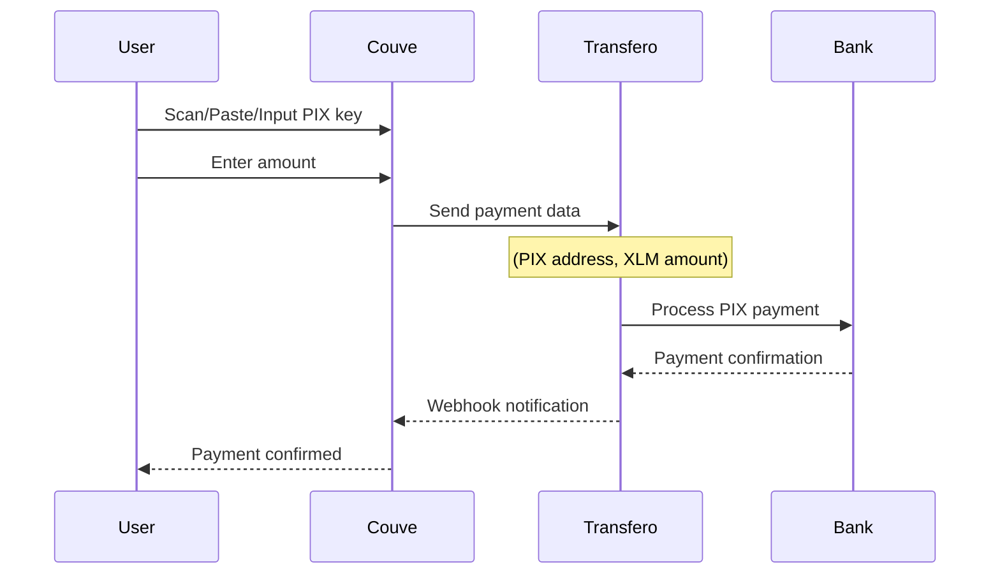
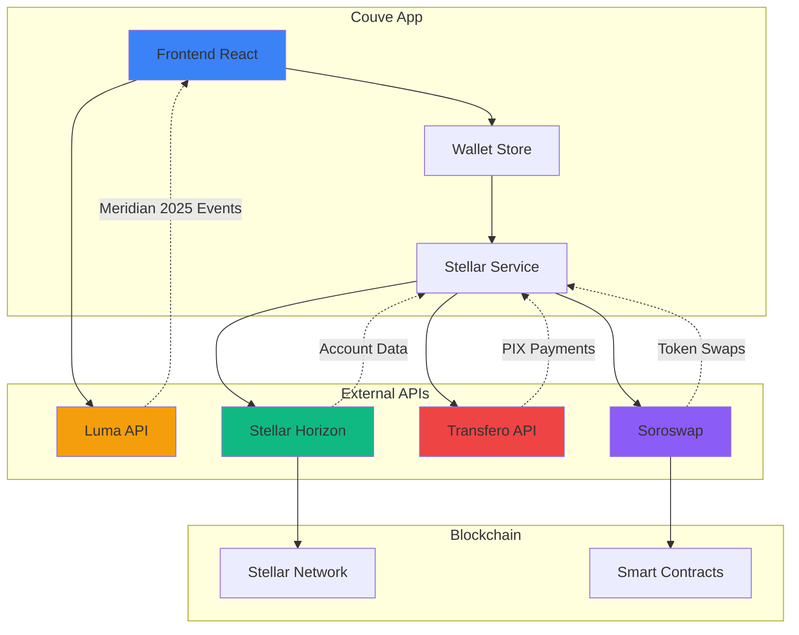

# Couve - Stellar Wallet App

Uma carteira moderna para a rede Stellar com integração PIX e eventos do Meridian 2025.


## 🚀 Funcionalidades

- 💳 Carteira Stellar integrada
- 🇧🇷 Pagamentos PIX via Stellar
- 🎉 Carrossel de eventos do Meridian 2025 com API do Luma
- 📱 Interface mobile-first responsiva
- 🌟 Design moderno com Tailwind CSS

## 🛠️ Configuração

### Pré-requisitos

- Node.js 18+
- npm ou yarn

### Instalação

```bash
# Clone o repositório
git clone <repository-url>
cd couve

# Instale as dependências
npm install

# Configure as variáveis de ambiente
cp .env.example .env
```

### Configuração da API do Luma (Opcional)

Para integrar eventos reais do Luma:

1. Acesse [Luma Dashboard](https://lu.ma/dashboard)
2. Vá em Settings → API Keys
3. Gere uma nova API key
4. Adicione no arquivo `.env`:

```env
VITE_LUMA_API_KEY=sua_api_key_aqui
```

### Executar o projeto

```bash
npm run dev
```

## 📱 Fluxos Principais


### FLOW ONBOARDING



### FLOW PAY PIX



## 🎨 Componentes Principais

- **MeridianEventsCarousel**: Carrossel interativo de eventos com integração API do Luma
- **WalletStore**: Gerenciamento de estado da carteira Stellar
- **BalanceCard**: Exibição de saldos e conversões
- **QuickActions**: Ações rápidas para pagamentos PIX

## 🌐 APIs Integradas



### APIs Detalhadas

- **Luma API**: Eventos do Meridian 2025
- **Stellar Horizon**: Rede Stellar
- **Transfero**: Pagamentos PIX
- **Soroswap**: Swaps de tokens na Stellar

## 🤝 Contribuindo

1. Fork o projeto
2. Crie uma branch para sua feature
3. Commit suas mudanças
4. Push para a branch
5. Abra um Pull Request
