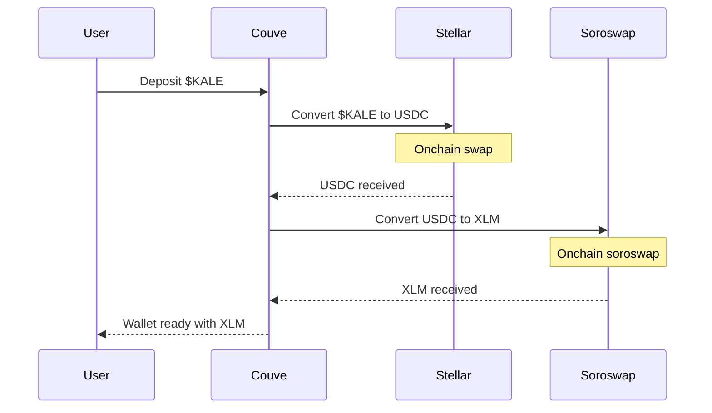
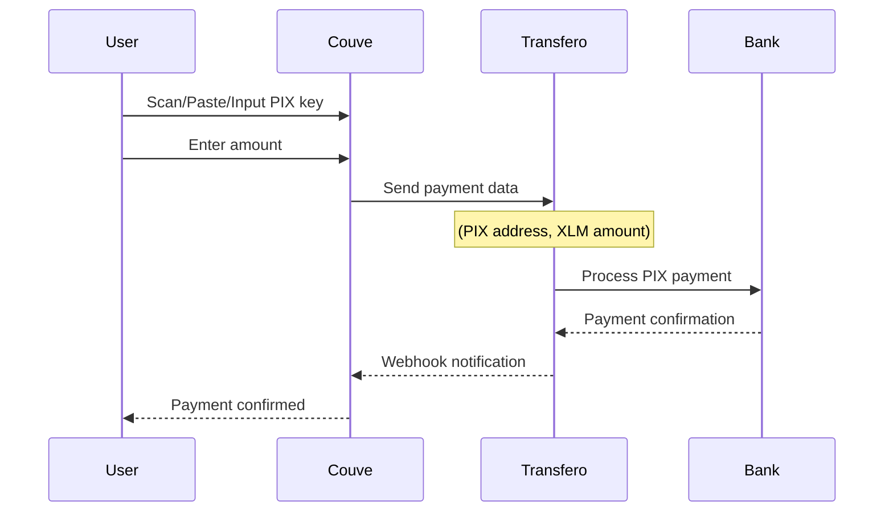
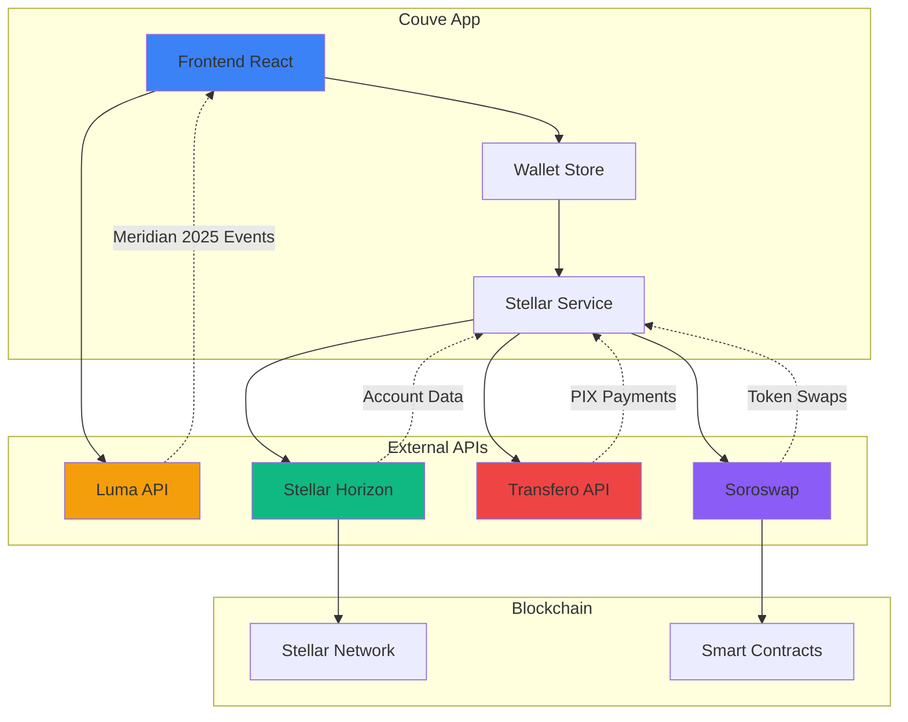

# CouvePIX - Official Kale Wallet for Meridian 

A modern wallet for the Stellar network with PIX integration and Meridian 2025 events.


## 🚀 Features

- 💳 Integrated Stellar wallet
- 🇧🇷 PIX payments via Stellar
- 🎉 Meridian 2025 events carousel with Luma API
- 📱 Mobile-first responsive interface
- 🌟 Modern design with Tailwind CSS

## 🛠️ Setup

### Prerequisites

- Node.js 18+
- npm or yarn

### Installation

```bash
# Clone the repository
git clone <repository-url>
cd couve

# Install dependencies
npm install

# Configure environment variables
cp .env.example .env
```

### Luma API Configuration (Optional)

To integrate real Luma events:

1. Access [Luma Dashboard](https://lu.ma/dashboard)
2. Go to Settings → API Keys
3. Generate a new API key
4. Add to the `.env` file:

```env
VITE_LUMA_API_KEY=your_api_key_here
```

### Run the project

```bash
npm run dev
```

## 📱 Main Flows


### FLOW ONBOARDING



### FLOW PAY PIX



## 🎨 Main Components

- **MeridianEventsCarousel**: Interactive events carousel with Luma API integration
- **WalletStore**: Stellar wallet state management
- **BalanceCard**: Balance display and conversions
- **QuickActions**: Quick actions for PIX payments

## 🌐 Integrated APIs



### Detailed APIs

- **Luma API**: Meridian 2025 events
- **Stellar Horizon**: Stellar network
- **Transfero**: PIX payments
- **Soroswap**: Token swaps on Stellar

## 🤝 Contributing

1. Fork the project
2. Create a branch for your feature
3. Commit your changes
4. Push to the branch
5. Open a Pull Request
